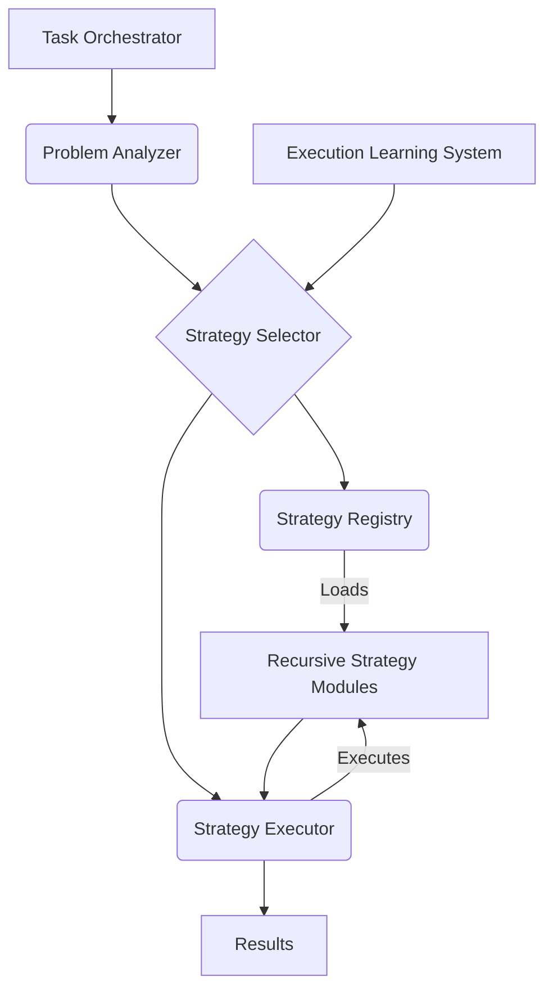

# Detailed Design: Tiered Problem-Solving Framework

## 1. Introduction

This document provides a detailed design for the Tiered Problem-Solving Framework, a core component of the Vertex Full-Stack System. This framework is responsible for selecting and executing appropriate problem-solving strategies, leveraging a variety of recursive techniques to handle diverse tasks efficiently and effectively. It incorporates lazy-loading for strategies and integrates with the Execution Learning System for continuous improvement.

## 2. Purpose and Scope

- **Purpose**: To provide a flexible and adaptive mechanism for solving complex problems by decomposing them and applying the most suitable recursive strategies based on problem characteristics, resource constraints, and historical performance.
- **Scope**: This framework encompasses strategy registration, problem analysis, strategy selection, strategy execution using various recursive patterns, and integration with other Vertex components like the Task Orchestrator, Resource Optimization Layer, and Execution Learning System.

## 3. Architecture

The framework consists of the following key components:

- **Strategy Registry**: Manages available problem-solving strategies, including metadata and lazy-loading mechanisms.
- **Problem Analyzer**: Assesses incoming tasks to determine complexity, type, constraints, and other relevant characteristics.
- **Strategy Selector**: Chooses the optimal strategy (or sequence of strategies) based on analysis from the Problem Analyzer and historical performance data from the Execution Learning System.
- **Strategy Executor**: Executes the selected strategy, managing the recursive process, handling state, and collecting results.
- **Recursive Strategy Modules**: Implementations of the six core recursive patterns (Tail, Non-Tail, Tree/Multiple, Mutual, Divide-and-Conquer, Backtracking) as pluggable modules.

## 4. Component Details

### 4.1 Strategy Registry
- **Functionality**: Maintains a catalog of available recursive strategy modules.
- **Metadata**: Stores information about each strategy, including:
  - `strategy_id`: Unique identifier.
  - `name`: Human-readable name (e.g., "Tail Recursion Cleanup").
  - `type`: One of the six core recursive types.
  - `description`: Purpose and typical use cases.
  - `input_schema`: Expected input data format.
  - `output_schema`: Expected output data format.
  - `complexity_profile`: Typical time/space complexity.
  - `resource_requirements`: Estimated compute/memory needs.
  - `module_path`: Location of the implementation.
- **Lazy Loading**: Implements lazy loading using:
  - **Module Proxies**: A lightweight proxy object is registered initially. The actual module is loaded only when the strategy is selected for execution.
  - **Conditional Imports**: Python's `importlib` will be used to dynamically import strategy modules based on `module_path`.
- **API**:
  - `register_strategy(metadata)`
  - `get_strategy_metadata(strategy_id)`
  - `list_strategies(filter_criteria)`
  - `load_strategy_module(strategy_id)` (internal, called by Executor)

### 4.2 Problem Analyzer
- **Functionality**: Analyzes incoming tasks or problems to extract key characteristics.
- **Analysis Parameters**:
  - Task type (e.g., data transformation, search, optimization, generation).
  - Input data size and structure.
  - Required output format.
  - Constraints (time limits, credit budget, quality requirements).
  - Dependencies on other tasks or data.
  - Estimated complexity (based on heuristics or initial analysis).
- **API**:
  - `analyze_problem(task_definition)` -> `problem_profile`

### 4.3 Strategy Selector
- **Functionality**: Selects the most appropriate strategy or sequence of strategies.
- **Selection Logic**:
  1. Receives `problem_profile` from the Problem Analyzer.
  2. Queries the Strategy Registry for potentially applicable strategies based on type, input/output schema, etc.
  3. Queries the Execution Learning System for historical performance data of candidate strategies on similar problems.
  4. Considers current resource availability and constraints (from Resource Optimization Layer).
  5. Ranks strategies based on predicted effectiveness, efficiency, and cost.
  6. Selects the top-ranked strategy or constructs a sequence (workflow) of strategies.
- **Fallback Mechanism**: If the primary strategy fails, the Selector can choose an alternative based on pre-defined fallback rules or real-time analysis.
- **API**:
  - `select_strategy(problem_profile, historical_data)` -> `selected_strategy_id` or `strategy_workflow`

### 4.4 Strategy Executor
- **Functionality**: Executes the chosen recursive strategy module(s).
- **Execution Process**:
  1. Receives `selected_strategy_id` or `strategy_workflow` from the Selector.
  2. Requests the Strategy Registry to load the required module(s) (triggering lazy-loading if necessary).
  3. Initializes the strategy module with the task data and context.
  4. Invokes the strategy's main execution method (e.g., `process()`).
  5. Manages the recursive calls, potentially distributing work for parallel strategies (Tree, Divide-and-Conquer).
  6. Monitors execution progress, resource usage, and potential errors.
  7. Implements error handling, including triggering fallback mechanisms via the Strategy Selector if needed.
  8. Collects and formats the final results.
  9. Reports execution traces and outcomes to the Execution Learning System.
- **State Management**: Handles context preservation between recursive calls, especially for non-tail recursion.
- **Resource Management**: Interfaces with the Resource Optimization Layer to adhere to budgets and potentially throttle execution.
- **API**:
  - `execute(strategy_id_or_workflow, task_data, context)` -> `execution_result`

### 4.5 Recursive Strategy Modules
- **Standard Interface**: Each module implements a common interface:
  - `process(data, context, **kwargs)`: Main execution entry point.
  - `validate_input(data)`: Checks if input data conforms to schema.
  - `health_check()`: Reports module status.
- **Implementations**:
  - **Tail Recursion**: Optimized for TCO where possible; focuses on final-step processing.
  - **Non-Tail (Head) Recursion**: Manages state accumulation during the unwinding phase.
  - **Tree/Multiple Recursion**: Implements logic to spawn multiple sub-problems, potentially using parallel execution frameworks (e.g., `asyncio`, `multiprocessing`).
  - **Mutual (Indirect) Recursion**: Implemented as a set of cooperating modules representing different states or functions.
  - **Divide-and-Conquer**: Includes logic for splitting the problem, recursively solving subproblems, and merging results.
  - **Backtracking**: Manages exploration state, constraint checking, and backtracking logic.
- **Self-Testing**: Each module includes base-case validation and internal exception handling to support error isolation.

## 5. Workflow Example: Solving a Complex Task

1. **Task Received**: Task Orchestrator sends a complex task to the Tiered Problem-Solving Framework.
2. **Analysis**: Problem Analyzer determines it's a large data processing task suitable for Divide-and-Conquer.
3. **Selection**: Strategy Selector confirms Divide-and-Conquer is appropriate, checks historical data, and selects the `DivideAndConquerSort` strategy.
4. **Execution**: Strategy Executor loads the `DivideAndConquerSort` module (lazy-loaded via proxy).
5. **Recursion**: The module recursively splits the data, processes sub-problems (potentially spawning parallel tasks), and merges results.
6. **Sub-Problem Handling**: If a sub-problem requires a different approach (e.g., constraint satisfaction on a subset), the Executor might recursively invoke the framework, leading to the selection of a Backtracking strategy for that sub-task.
7. **Compounding**: Intermediate results might be cached (memoization) if applicable.
8. **Result**: The final sorted data is returned.
9. **Learning**: Execution traces (time taken, resources used, success/failure) are sent to the Execution Learning System.

## 6. Integration with Other Systems

- **Task Orchestrator**: Provides tasks and receives results.
- **Resource Optimization Layer**: Provides constraints (credits, time) and receives usage data.
- **Execution Learning System**: Provides historical performance data and receives execution traces.
- **Knowledge & Context System**: Strategies may interact with this system to retrieve or store relevant information during execution.
- **MCP Integration Layer**: Some strategies might leverage MCP tools (e.g., Exa Search within a backtracking strategy).

## 7. Failure Handling and Synergy

- **Recursive Self-Test**: Modules validate their own inputs and base cases.
- **Executor Error Handling**: Catches exceptions from modules.
- **Fallback Strategies**: Selector chooses alternatives upon failure notification from the Executor.
- **Rollback/Rollforward**: Coordinated by the Task Orchestrator based on failure severity, potentially involving re-running the problem with adjusted parameters or a different strategy sequence.
- **Synergy**: Strategies can be chained (cascading workflow) by the Selector to combine strengths (e.g., Divide-and-Conquer followed by Tail Recursion cleanup).

## 8. Future Enhancements

- Dynamic strategy synthesis based on problem analysis.
- Automated A/B testing of different strategies.
- Deeper integration with sleep-time optimization for pre-loading anticipated strategies.
